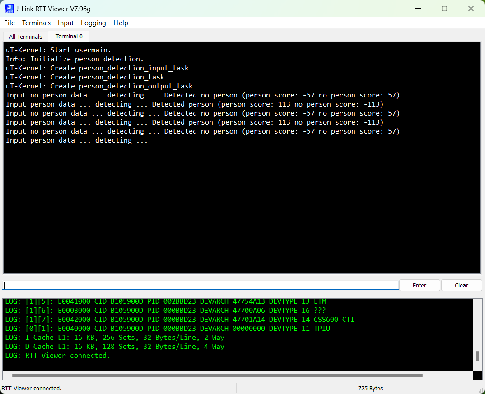

# µT-Kernel AI Interpreter (Proof of concept)

*Combining AI and RTOS for resource constrained embedded systems.*

## Introduction

The rapid expansion of the AIoT underscores the increasing significance of
embedded systems and their fundamental real-time operating systems.
Moreover, in today's societal drive toward carbon neutrality, the need for
energy-efficient embedded systems is increasing rapidly.

A machine learning model is utilized by an AI interpreter to process data and
generate outcomes. µT-Kernel is a real-time OS for small embedded systems.
It can run on embedded systems with a very small amount of ROM and RAM.
Employing a µT-Kernel AI Interpreter enhances flexibility and scalability
compared to using a bare-metal AI interpreter. With this setup, each RTOS task
can be fine-tuned in terms of priority and periodicity, enabling developers to
meet specific real-time and energy-efficiency requirements effectively.

To showcase the capabilities of the µT-Kernel AI Interpreter, a person
detection example application is deployed on an MCU-based board. This proof of
concept would aptly demonstrate the capability of the µT-Kernel AI Interpreter
development.


## Demonstration

The person detection example application demonstrates how an application
detects the presence of a person. The example application creates and
synchronizes 3 µT-Kernel tasks:

* person_detection_input: This task loads images stored in ROM.
* person_detection: This task detects the presence of a person in the loaded image.
* person_detection_output: This task responses to the result of detection.



The below images are stored in ROM and loaded alternatively.

| no-person                           | person                        |
| ----------------------------------- | ----------------------------- |
|  |  |

To run the person detection example app, import the below projects:

* tflm: AI interpreter.
* tflm_person_detection_mtk3: Example application.

Build and run the project tflm_person_detection_mtk3.

## Specifications

* Refer [here](./docs/poc-specs.md).

## Getting started

### Setup the development environment

* Refer [here](./docs/poc-specs.md#development-environment).

### Clone the repository

Run the command git clone.

```bash
git clone https://github.com/tu-thai/tflm-ekra8m1-mtk3.git --recurse-submodules
```

If you downloaded the repository without using the `--recurse-submodules` argument, you should run the below command to acquire the submodules.

```bash
git submodule update --init --recursive
```

### Import projects to e² studio

(1) Open e² studio.

(2) Choose a workspace and click **Launch**.

(3) **File** > **Import...** > **General** > **Existing Projects into WorkSpace**.

(4) Click **Browse...** and choose the `projects` folder. Click **Select Folder**.

(5) Select the projects you want to import.

(6) Ensure that **Copy projects into workspace** is not selected.

(7) Click **Finish** to import the projects.

### Build and debug a project with e² studio

(1) Select a project to be debugged on the **Project Explorer** view. Click
**Project** > **Build Project** to build the project.

(2) Ensure that debugger connection is established. Click **Run** >
**Run Debug Configurations...** Select the corresponding debug configuration
under the Renesas GDB Hardware Debugging group. Click **Debug** to start
debugging the project.

### Setup debugging

(1) Connect the host computer to the USB Debug Port (J10) on EK-RA8M1.

(2) Launch e² studio.

(3) Select a project to be debugged on the **Project Explorer** view. Click
**Project** > **Build Project** to build the project.

(4) Click **Run** > **Run Debug Configurations...**. Select the corresponding
debug configuration under the **Renesas GDB Hardware Debugging** group. Click
**Debug** to start debugging the project.

(5) Launch J-Link RTT Viewer. Configure the connection as follow.

| Item                  | Contents                            |
| --------------------- | ----------------------------------- |
| Connection to J-Link  | USB                                 |
| Specify Target Device | R7FA8M1AH                           |
| Target Interface      | SWD                                 |
| Speed                 | 4000 kHz                            |
| RTT Control Block     | Search Range                        |
|                       | Address range: `0x22000000 0xE0000` |
