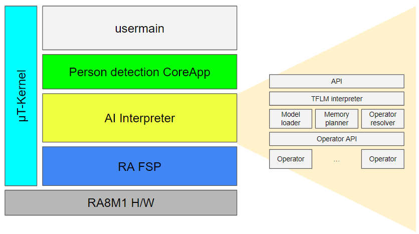
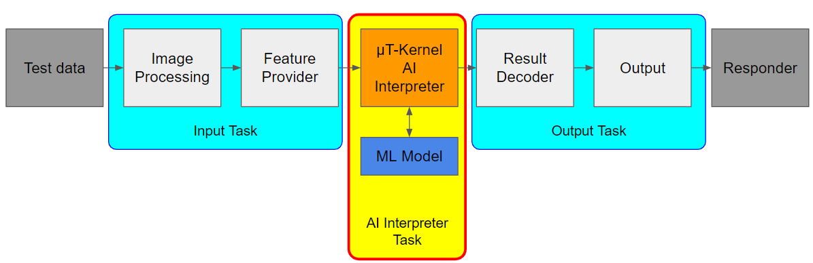

# µT-Kernel AI Interpreter (Proof of concept) Specifications

## Features

* Combining AI and RTOS for resource constrained embedded systems
  * Flexibility and scalability
  * Small memory footprint
  * Real-time

## Development environment

### Hardware

| Item          | Contents                                                                                                                                          |
| ------------- | ------------------------------------------------------------------------------------------------------------------------------------------------- |
| Target board  | [Renesas EK-RA8M1](https://www.renesas.com/en/products/microcontrollers-microprocessors/ra-cortex-m-mcus/ek-ra8m1-evaluation-kit-ra8m1-mcu-group) |
| Host computer | Windows 11 computer                                                                                                                               |

### Software

| Item      | Contents                                                                                              |
| --------- | ----------------------------------------------------------------------------------------------------- |
| IDE       | [e² studio](https://www.renesas.com/en/software-tool/e-studio) 2024-07                                |
| Toolchain | [Arm GNU Toolchain](https://developer.arm.com/Tools%20and%20Software/GNU%20Toolchain) 13.2.1.arm-13-7 |
| Terminal  | [J-Link RTT Viewer](https://www.segger.com/products/debug-probes/j-link/tools/rtt-viewer/) V7.96g     |

## Software dependencies

| Item     | Contents                                                                                        |
| -------- | ----------------------------------------------------------------------------------------------- |
| Firmware | [Renesas RA FSP](https://www.renesas.com/en/software-tool/flexible-software-package-fsp) v5.3.0 |
| Library  | [LiteRT for Microcontrollers](https://ai.google.dev/edge/litert/microcontrollers/overview)      |
| RTOS     | [µT-Kernel 3.00](https://github.com/tron-forum/mtkernel_3)                                      |

## Folder structure

* `applications`: Example applications.
* `docs`: Documentation.
* `mtk3_bsp2`: µT-Kernel and its system dependencies.
* `projects`: e² studio projects.
* `RA8M1`: RA8M1 specific.
* `SEGGER_RTT`: SEGGER RTT specific.
* `tflm`: LiteRT for Microcontrollers.

## Software configuration

* Application developers only need to customize the usermain part, for example:
  * tune the priority and periodicity of tasks;
  * share data between tasks;
  * create application-dependent tasks.

| Item                     | Contents                                                                                            |
| ------------------------ | --------------------------------------------------------------------------------------------------- |
| usermain                 | Application-dependent customizable part                                                             |
| Person detection CoreApp | A CoreApp detects the presence of a person                                                          |
| AI Interpreter           | Machine learning inference framework for microcontrollers, adopted from LiteRT for Microcontrollers |
| RA FSP                   | Renesas RA Flexible Software Package                                                                |
| µT-Kernel                | Real-time OS for Small-scale Embedded Systems and IoT Edge nodes developed by TRON Forum            |
| RA8M1 H/W                | 480 MHz Arm® Cortex®-M85 Based Microcontroller with Helium and TrustZone®                           |

## Person detection CoreApp

* Detect the presence of a person using deep learning model.
* Provide simple API for application developers without the need of deep
  expertise in deep learning.
* Small memory footprint.
* Deep learning architecture: MobileNets.
* Pre-trained model using  Visual Wake Words dataset contains images that
  belong to 2 classes (person or not-person).

## usermain

* Sample application to detect the presence of a person.
* Test data are stored in ROM.
  There are 2 test data: with and without a person,
  corresponding to 2 grayscale images (96x96 pixels).

One major advantage of using µT-Kernel is the flexibility and scalability it
offers, which would be difficult to achieve with a baremetal implementation.
Each RTOS task can be individually tuned for priority and periodicity,
allowing for adjustments that help meet the system's energy-efficiency and
real-time requirements.

Input Task serves as an abstraction for an image source, such as a camera.
It is designed to be invoked in a low-duty cycle manner, typical in low-power
applications. In such scenarios, the imaging sensor doesn't need to operate in
continuous streaming mode but can remain in a low-power idle state between calls.

Output Task is called every time the results of a person detection run are available.

AI Interpreter Task consumes the most computing resource and power.
It can be put into sleep state if there is no input available to save resource and energy.

RTOS also enables scalability in the user application. As new sensors are
added, you can simply create a new task to handle the additional data. If the
model changes, you can update the interpreter without disrupting other tasks.
Moreover, if you want to reuse the model in different applications, you can
easily transfer the task and its supporting code modules with minimal
adjustments.

## Memory usage

| Item                     | ROM    | RAM    |
| ------------------------ | ------ | ------ |
| Person detection model   | ~300KB |        |
| Person detection CoreApp | ~1KB   | ~140KB |
| AI Interpreter           | ~45KB  |        |
| µT-Kernel                | ~17KB  | ~11KB  |
